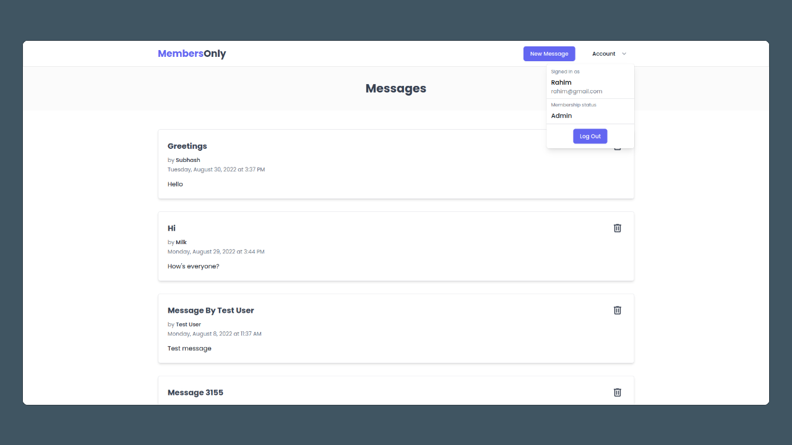

# Members Only



**:key: Secret Code (case-sensitive):** The Odin Project

**:point_right: See it live [here](https://members-only-top.netlify.app/)**

Members Only is an exclusive clubhouse where anyone can come and see the messages but only logged-in users can write new messages. To see who created the message and when users have to get the membership by entering a SECRET code. Users can check their membership status in the navigation menu. There's also an admin who can see all the messages with author, date, and time, and can also delete the messages.

I created this project mainly to practice full-stack development with a focus on authentication and user permissions management.

## Features

- Create and Read public messages.
- User authentication with JWTs (JSON Web Token).
- User authorization and permissions management (Admin, member, and non-member but registered user).
- Server side APIs are written using REST architecture.
- Securing passwords using bcryptjs.
- Membership by entering a secret code.
- Schema validation using Mongoose.
- Client side form validation using react-hook-form before submitting user data.

## Run It Locally

### Prerequisites

- You'll need a running MongoDB instance, either locally or deployed in the cloud. You can deploy one easily following this [documentation](https://www.mongodb.com/docs/atlas/getting-started/).
- Nodejs version `16.17.0` or above.

### Cloning the repository

```bash
# Clone this repository
$ git clone git@github.com:rahimratnani/members-only.git

# Go into the reposit
$ cd members-only
```

### Getting the client ready

From `members-only` directory run the following commands.

```bash
# Go to client directory
$ cd client

# Install dependencies
$ npm install
```

### Getting the server ready

If you're in `client` directory, change back to `members-only` by running `cd ..`. From `members-only` directory run the following commands.

```bash
# Go to server directory
$ cd server

# Install dependencies
$ npm install
```

### Setting up environment variables

- Rename `.env.example` files located in `client` and `server` directories to `.env`.
- Populate `.env` located in server with the following environment variables:
  - `PORT`: Your node server will run on this port. Default is 3001. If you want to use a different port, make sure to update it in client's `.env` file.
  - `NODE_ENV`: Default is `development`.
  - `DB_URL`: Update the placeholders with your running MongoDB instance's data.
  - `JWT_SECRET`: A string that will be used to sign JWT tokens. Make sure it's hard and complicated enough to guess.
  - `MEMBERSHIP_CODE`: The secret code you want user to enter to get membership.
- Update the environment variables and save the file.

### Starting the application

From `members-only` directory, run the following commands:

```bash
# Go to server directory
$ cd server

# Start the server
$ npm run dev

# Open another terminal tab
# Go to client directory
$ cd ../client

# Start the client
$ npm start
```

## Technologies Used

- [Nodejs](https://nodejs.org/)
- [TypeScript](https://www.typescriptlang.org/)
- [Expressjs](https://expressjs.com/)
- [MongoDB](https://www.mongodb.com/)
- [Mongoosejs](https://mongoosejs.com/)
- [Reactjs](https://reactjs.org/)
- [Tailwind CSS](https://tailwindcss.com/)
- [React Hook Form](https://react-hook-form.com/)
